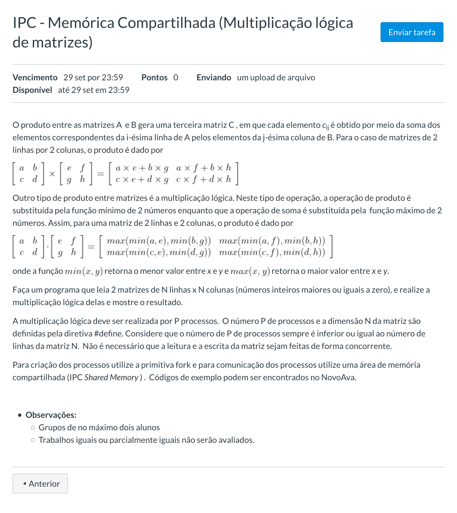

# Multiplicação Lógica de Matrizes com memória compartilhada

## Sobre
Projeto para a disciplina de Programação Concorrente.
Multiplicação de matrizes utilizando área de memória compartilhada entre múltiplos processos.
Autor: [Rafael Bourscheid da Silveira](https://github.com/bsrafael/shm-logic-matrix-multiplication)

## Executar
```
gcc matriz.c -o matriz
./matriz
```

### Controlar tamanho da matriz e número de processos
- linha 7: tamanho da matriz
  ```#define N 4```
- linha 8: número de processos
  ```#define P 3```
- lembrar que N >= P

### Gerar matrizes automaticamente
- comentar linhas 96 a 100
    ```
    printf("\nPrimeira matriz\n");
    ler_matriz(mat1);

    printf("\nSegunda matriz\n");
    ler_matriz(mat2);
    ```
- descomentar linha 102
    ```mock(mat1, mat2);```

## Especificação

